# Projetos Power BI

Este repositório é dedicado a projetos de análise de dados com o Power BI. O objetivo desse repositório é disponibilizar conjuntos de análises de dados prontas para uso em diversas áreas.

## Índice de Projetos

1. [Acompanhamento Financeiro - Demonstração do Resultado do Exercício (DRE)](#projeto-01)
2. [Acompanhamento de Vendas](#projeto-02)
3. [Acompanhamento de Metas e Visão Geral de Vendas](#projeto-03)
4. [Acompanhamento de Projetos](#projeto-04)
5. [Gestão e Acompanhamento de Obras](#projeto-05)
6. [Acompanhamento de Vendas](#projeto-06)
7. [Gestão de Lojas](#projeto-07)
8. [Análise de Faturamento, Vendedores e Clientes](#projeto-08)
9. [Relatório de Acidentes em Rodovias Federais](#projeto-09)
10. [Análise de Atendimentos de Emergência](#projeto-10)
11. [Análise de Vendas](#projeto-11)
12. [Análise de Performance NBA](#projeto-12)
13. [Simulação Financeira](#projeto-13)
14. [Análise da Produção de Petróleo em FPSOs](#projeto-14)
15. [Gestão de Faturamento e Logística](#projeto-15)
16. [Gestão de Faturamento e Logística](#projeto-16)
17. [Acompanhamento de Compras](#projeto-17)
18. [Acompanhamento de Compras](#projeto-18)
19. [Acompanhamento de Vendas](#projeto-19)
20. [Acompanhamento de Vendas: Franquia de Lojas](#projeto-20)
21. [Acompanhamento de Inspeções](#projeto-21)
22. [Acompanhamento Financeiro](#projeto-22)
23. [Acompanhamento de Atendimento](#projeto-23)
24. [Acompanhamento de Atendimento Hospitalares](#projeto-24)
25. [Relatório - Pesquisa de Satisfação dos Colaboradores](#projeto-25)
26. [People Analytics: Mapeamento de Colaboradores](#projeto-26)

---

## 🚀 Projetos

### Acompanhamento Financeiro - Demonstração do Resultado do Exercício (DRE) 

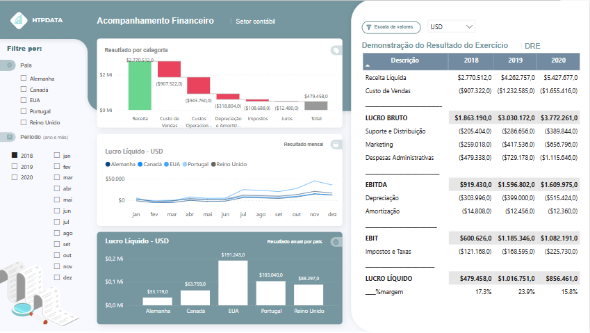

**[Projeto 01 - Link](https://github.com/marcelomduarte/acompanhamento_financeiro_dre_power_bi) | Atualizado: 09/03/2024**

[Índice ↑](#indice)

---

### Acompanhamento de Vendas 

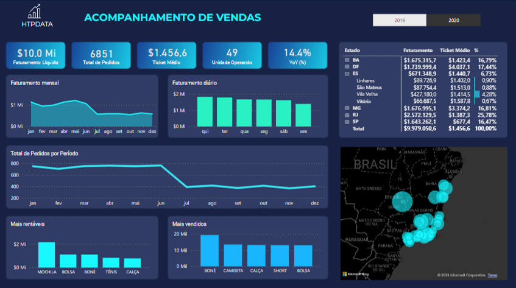

**[Projeto 02 - Power BI](https://app.powerbi.com/view?r=eyJrIjoiOTFjYjQwYTMtYzFlZC00OTcwLTkxYjUtMWUzNmE5NGNmZDg3IiwidCI6IjdlYmVmODBjLTEwMjctNDEyOS1iNDg0LWNjZjJiZDNmZDU4ZiJ9) | Atualizado: 09/03/2024**

[Índice ↑](#indice)

---

### Acompanhamento de Metas e Visão Geral de Vendas

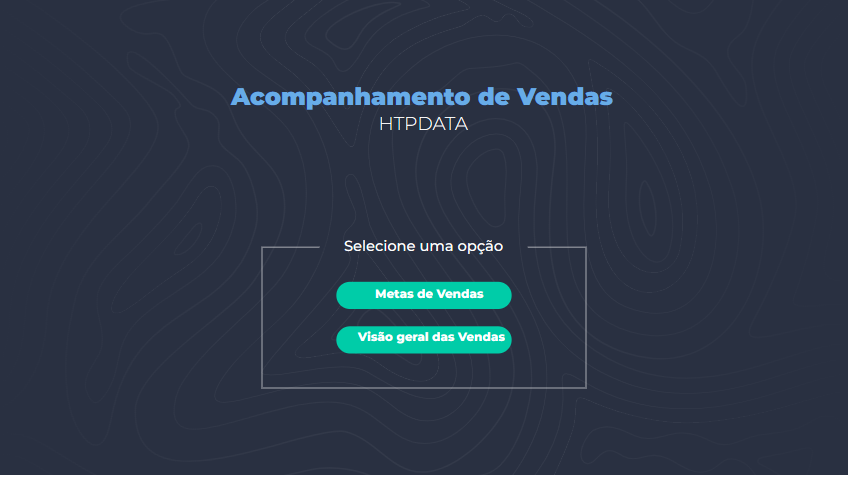

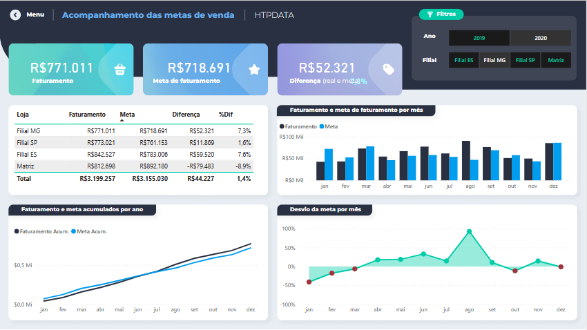

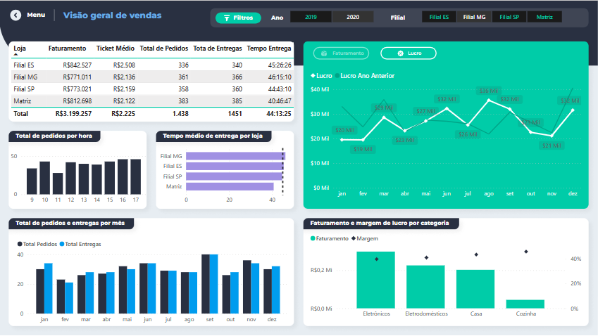

**[Projeto 03 - Power BI](https://app.powerbi.com/view?r=eyJrIjoiMjEwZmFmNzUtM2U2OS00MjY0LTg3ZWQtYzMzNTQ0ZTE1OTAxIiwidCI6IjdlYmVmODBjLTEwMjctNDEyOS1iNDg0LWNjZjJiZDNmZDU4ZiJ9) | Atualizado: 09/03/2024**

[Índice ↑](#indice)

---

### Acompanhamento de Projetos 

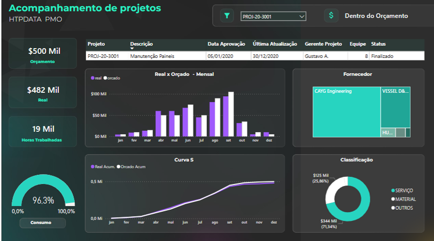

**[Projeto 04 - Power BI](https://app.powerbi.com/view?r=eyJrIjoiNDA0NDA3ZmEtNGNhOC00MmQ3LTkwMzktZTJkOWU3YzkxYWI5IiwidCI6IjdlYmVmODBjLTEwMjctNDEyOS1iNDg0LWNjZjJiZDNmZDU4ZiJ9) | Atualizado: 09/03/2024**

[Índice ↑](#indice)

---

### Gestão e Acompanhamento de Obras 

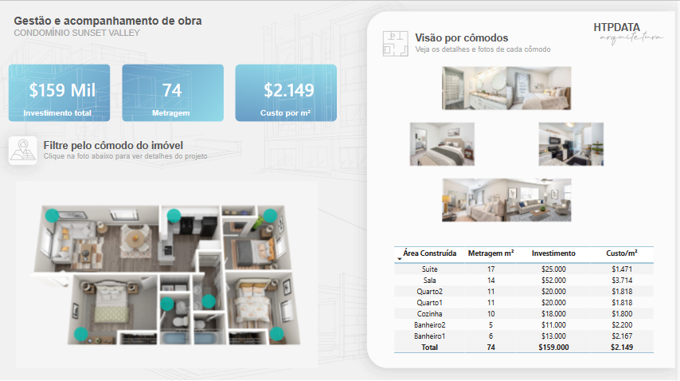

**[Projeto 05 - Power BI](https://app.powerbi.com/view?r=eyJrIjoiZDc5MWNhY2YtOWE5OC00NzNkLWFmYWQtMWQ4ZTRmZDMyMjFmIiwidCI6IjdlYmVmODBjLTEwMjctNDEyOS1iNDg0LWNjZjJiZDNmZDU4ZiJ9) | Atualizado: 09/03/2024**

[Índice ↑](#indice)

---

### Acompanhamento de Vendas

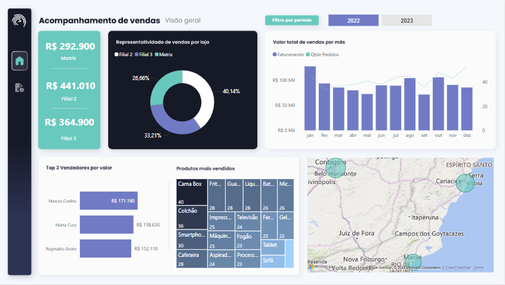

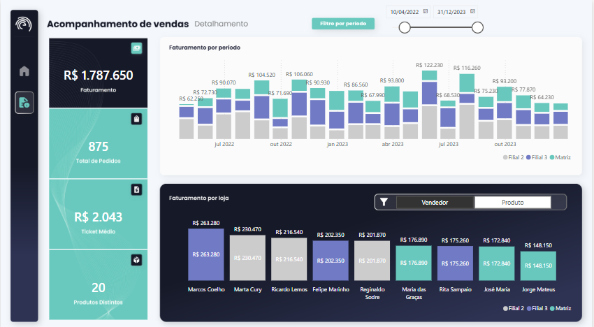

**[Projeto 06 - Power BI](https://app.powerbi.com/view?r=eyJrIjoiYWUwMmI5NjMtNzg4Yy00M2I5LWE1ODYtNGI3MjdjNDUzZjU5IiwidCI6IjdlYmVmODBjLTEwMjctNDEyOS1iNDg0LWNjZjJiZDNmZDU4ZiJ9) | Atualizado: 09/03/2024**

[Índice ↑](#indice)

---

### Gestão de Lojas 

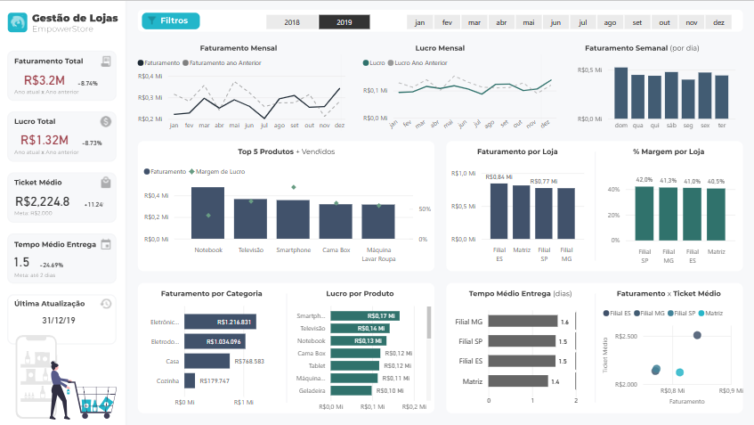

**[Projeto 07 - Power BI](https://app.powerbi.com/view?r=eyJrIjoiMTA1NzI0ODItNDdkNi00ZWQ2LWI1ZDItMjhhMDA0NjU5NDdlIiwidCI6IjdlYmVmODBjLTEwMjctNDEyOS1iNDg0LWNjZjJiZDNmZDU4ZiJ9) | Atualizado: 09/03/2024**

[Índice ↑](#indice)

---

### Análise de Faturamento, Vendedores e Clientes 

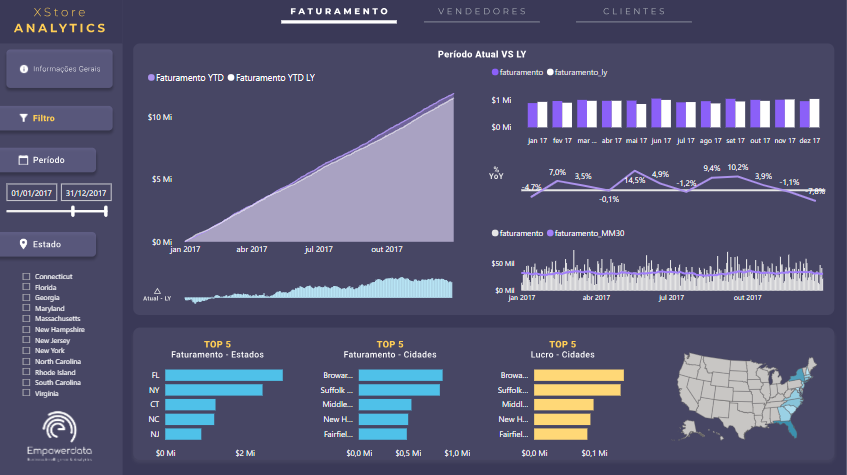

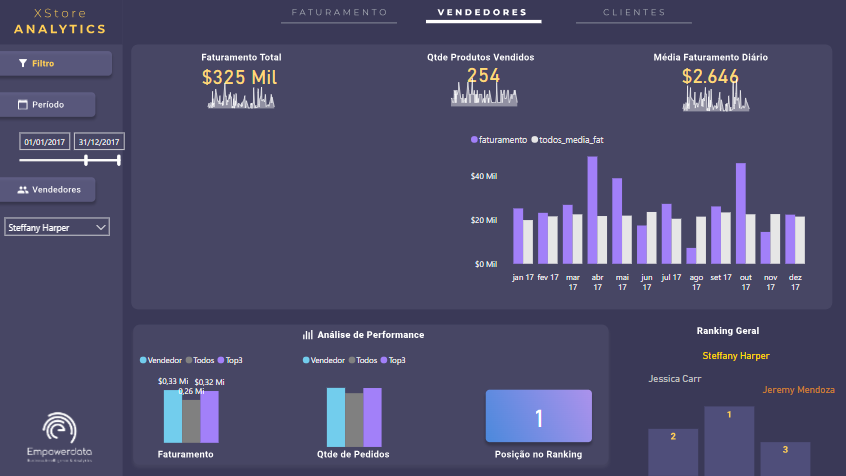

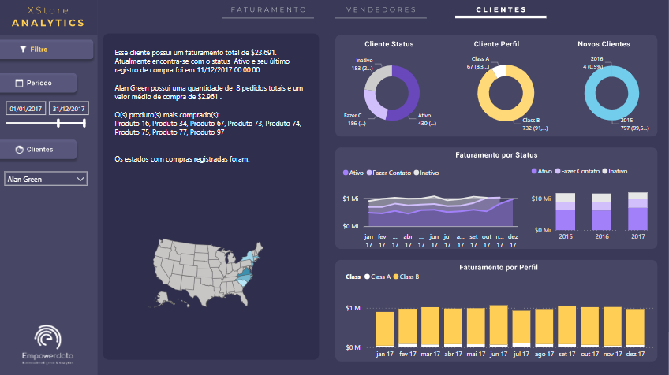

**[Projeto 08 - Power BI](https://app.powerbi.com/view?r=eyJrIjoiODkzMjNkZjctMzYyZC00MTdiLWIzYjEtYjIyODJkYmE4ZGQ0IiwidCI6IjdlYmVmODBjLTEwMjctNDEyOS1iNDg0LWNjZjJiZDNmZDU4ZiJ9) | Atualizado: 09/03/2024**

[Índice ↑](#indice)

---

### Relatório de Acidentes em Rodovias Federais 

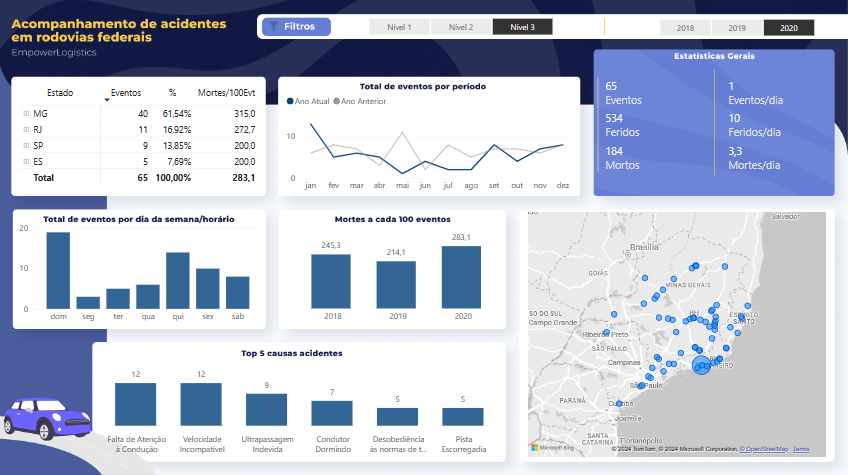

**[Projeto 09 - Link](https://github.com/marcelomduarte/acidentes_rodoviarios_power_bi) | Atualizado: 09/03/2024**

[Índice ↑](#indice)

---

### Análise de Atendimentos de Emergência 

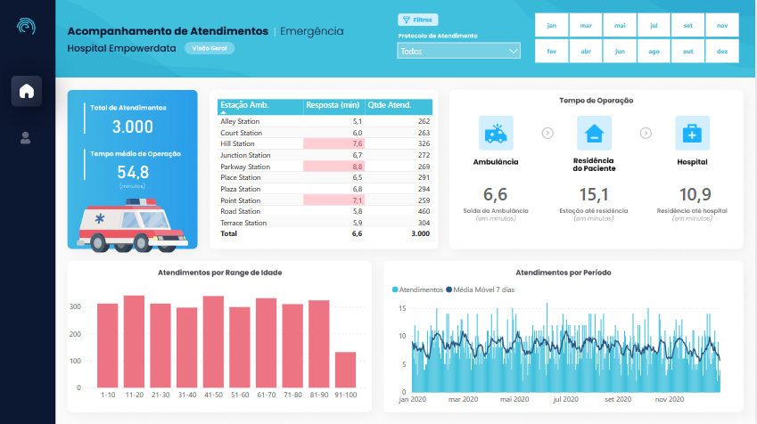

**[Projeto 10 - Link](https://github.com/marcelomduarte/analise_de_atendimentos_de_emergencia_power_bi) | Atualizado: 09/03/2024**

[Índice ↑](#indice)

---

### Análise de Vendas 

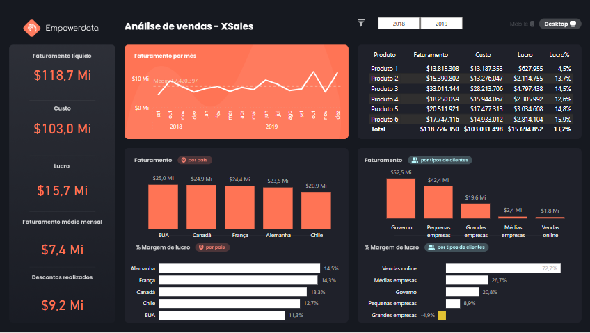

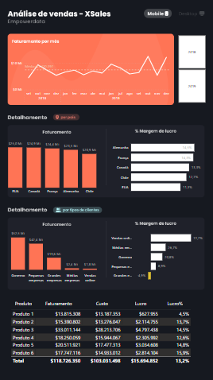

**[Projeto 11 - Link](https://github.com/marcelomduarte/analise_de_vendas_excel_power_bi) | Atualizado: 09/03/2024**

[Índice ↑](#indice)

---

### Análise de Performance NBA 

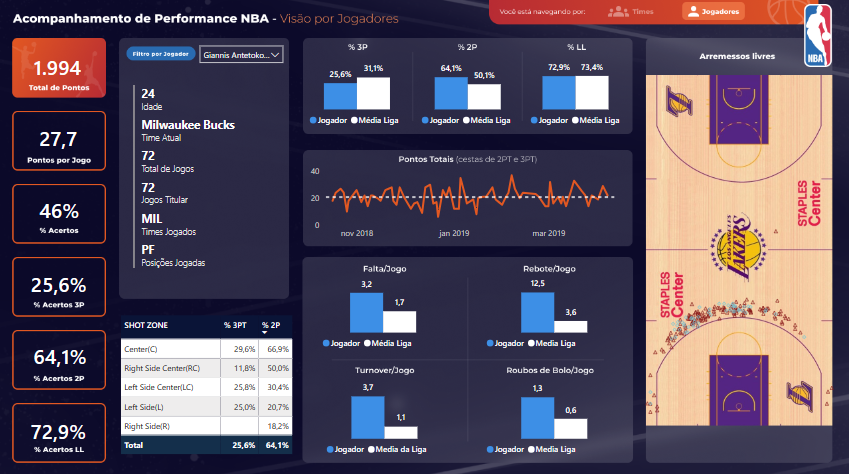

**[Projeto 12 - Power BI](https://app.powerbi.com/view?r=eyJrIjoiY2Q1NjUxNDAtNGM4OS00YmMwLThmMzAtMDcxMTU1MTRmYjZlIiwidCI6IjdlYmVmODBjLTEwMjctNDEyOS1iNDg0LWNjZjJiZDNmZDU4ZiJ9) | Em Atualização...**

[Índice ↑](#indice)

---

### Simulação Financeira 

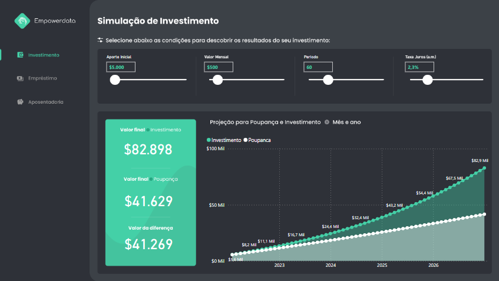

**[Projeto 13 - Power BI](https://app.powerbi.com/view?r=eyJrIjoiYzAyYWRkMjEtNzdhNi00NmZhLTk0ZDAtMmNiMThlOGMxMzRiIiwidCI6IjdlYmVmODBjLTEwMjctNDEyOS1iNDg0LWNjZjJiZDNmZDU4ZiJ9) | Em Atualização...**

[Índice ↑](#indice)

---

### Análise da Produção de Petróleo em FPSOs 

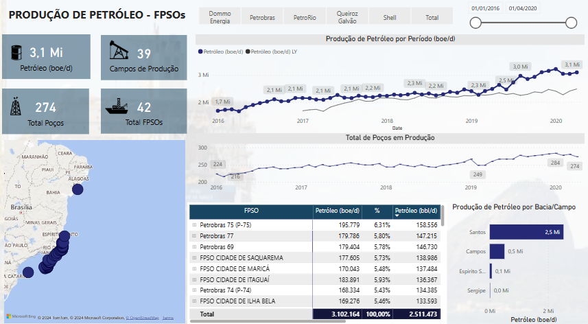

**[Projeto 14 - Power BI](https://app.powerbi.com/view?r=eyJrIjoiYjJjYzFkYzMtZTg5ZS00ZjY0LWJkMGYtMmM3OTVkMDUwZTI1IiwidCI6IjdlYmVmODBjLTEwMjctNDEyOS1iNDg0LWNjZjJiZDNmZDU4ZiJ9) | Em Atualização...**

[Índice ↑](#indice)

---

### Gestão de Faturamento e Logística 

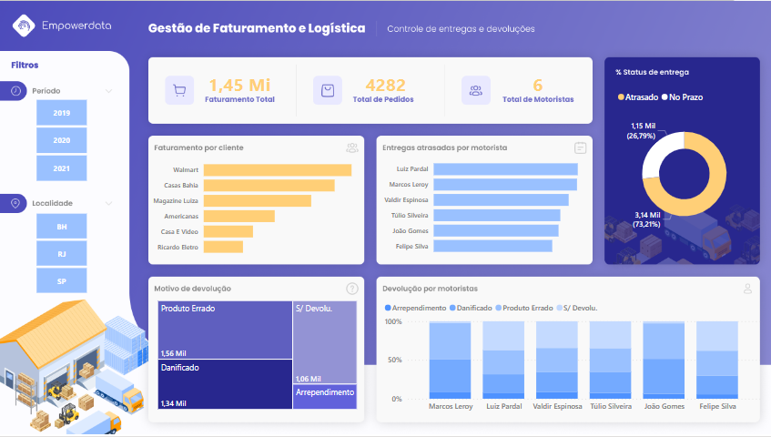

**[Projeto 15 - Power BI](https://app.powerbi.com/view?r=eyJrIjoiYWI3Y2M5MWEtYWNjOC00ZjlkLWI1NDktZjk2MjI4ZjEzNTY0IiwidCI6IjdlYmVmODBjLTEwMjctNDEyOS1iNDg0LWNjZjJiZDNmZDU4ZiJ9) | Atualizado: 10/03/2024**

[Índice ↑](#indice)

---

### Gestão de Faturamento e Logística 

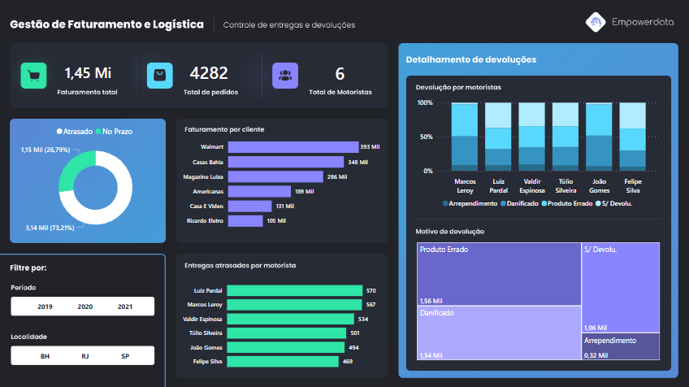

**[Projeto 16 - Power BI](https://app.powerbi.com/view?r=eyJrIjoiNDAxMWRhMzYtYTA2ZC00ZWM3LTk0MTQtNDMwNDMxMmVjZDY5IiwidCI6IjdlYmVmODBjLTEwMjctNDEyOS1iNDg0LWNjZjJiZDNmZDU4ZiJ9) | Atualizado: 10/03/2024**

[Índice ↑](#indice)

---

### Acompanhamento de Compras 

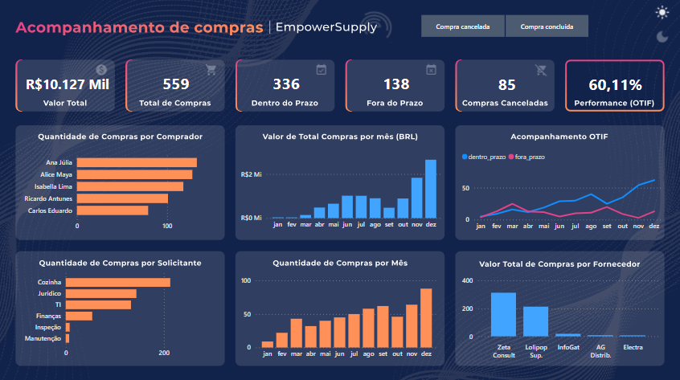

**[Projeto 17 - Power BI](https://app.powerbi.com/view?r=eyJrIjoiMjAxYWFiYTAtNTVhZC00ZjcyLTg5NmYtZDE2MmQ0NGYzNjc0IiwidCI6IjdlYmVmODBjLTEwMjctNDEyOS1iNDg0LWNjZjJiZDNmZDU4ZiJ9) | Atualizado: 10/03/2024**

[Índice ↑](#indice)

---

### Acompanhamento de Compras 

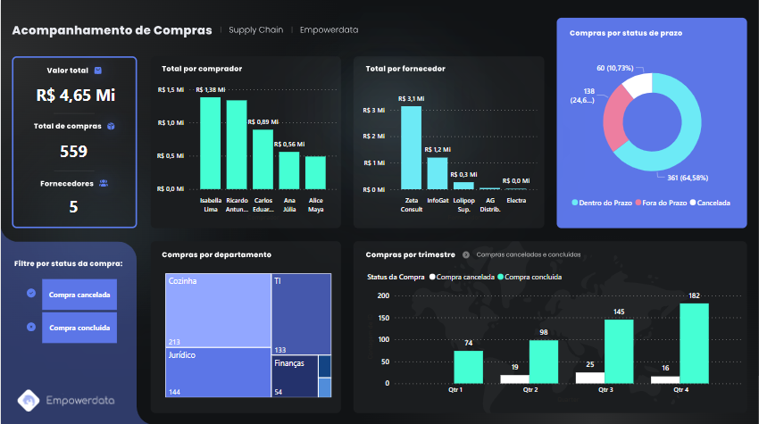

**[Projeto 18 - Power BI](https://app.powerbi.com/view?r=eyJrIjoiNWNlZjgwNjgtZTVkZi00MTc5LWFjZmItZTdkNDc1ODhhNDZhIiwidCI6IjdlYmVmODBjLTEwMjctNDEyOS1iNDg0LWNjZjJiZDNmZDU4ZiJ9) | Atualizado: 10/03/2024**

[Índice ↑](#indice)

---

### Acompanhamento de Vendas 

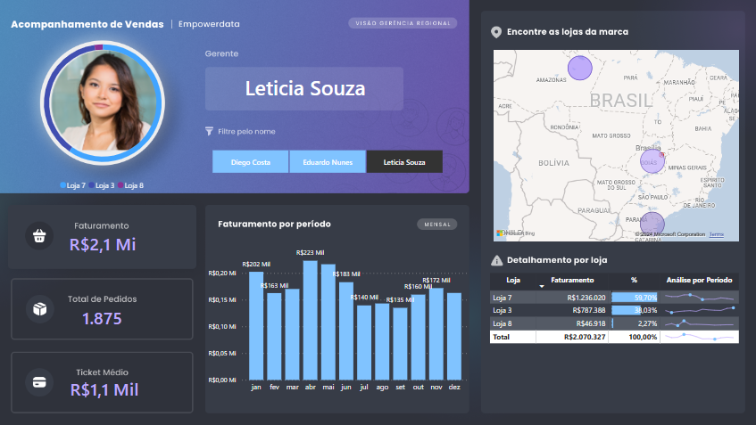

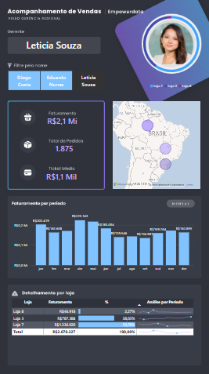

**[Projeto 19 - Power BI](https://app.powerbi.com/view?r=eyJrIjoiNWIwZDY1YjgtZmIxMy00MDRjLTg4MDktNGQxNTIzZDk1YzI1IiwidCI6IjdlYmVmODBjLTEwMjctNDEyOS1iNDg0LWNjZjJiZDNmZDU4ZiJ9) | Atualizado: 10/03/2024**

[Índice ↑](#indice)

---

### Acompanhamento de Vendas: Franquia de Lojas 

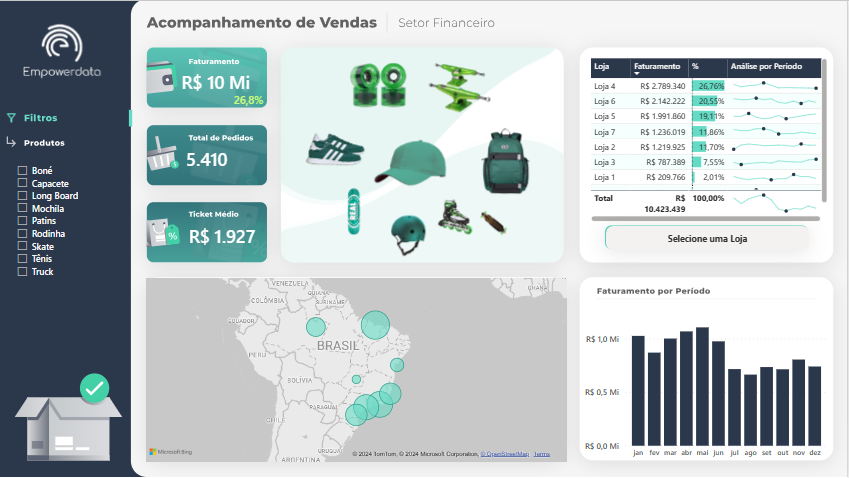

**[Projeto 20 - Power BI](https://app.powerbi.com/view?r=eyJrIjoiNTE3YjhhNzAtZmY0YS00ZjVlLWE3MTgtNWFhNGYwZDU2ZGEwIiwidCI6IjdlYmVmODBjLTEwMjctNDEyOS1iNDg0LWNjZjJiZDNmZDU4ZiJ9) | Atualizado: 10/03/2024**

[Índice ↑](#indice)

---

### Acompanhamento de Inspeções 

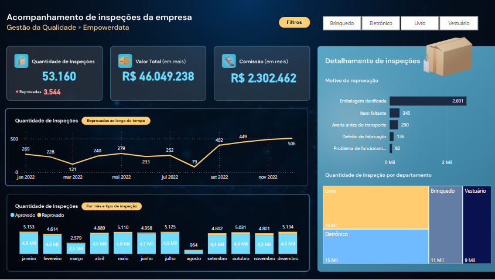

**[Projeto 21 - Power BI](https://app.powerbi.com/view?r=eyJrIjoiNzQ1NmM5YWMtN2M3OC00ZGY1LWE4NTMtYmMzMDc4MWFkZGQ3IiwidCI6IjdlYmVmODBjLTEwMjctNDEyOS1iNDg0LWNjZjJiZDNmZDU4ZiJ9) | Atualizado: 10/03/2024**

[Índice ↑](#indice)

---

### Acompanhamento Financeiro 

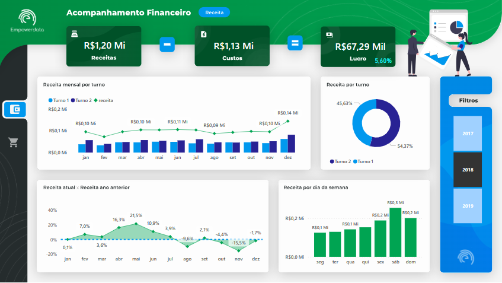

**[Projeto 22 - Power BI](https://app.powerbi.com/view?r=eyJrIjoiNDk1Yjk0NWUtZjczZC00ZGMxLWIyYWYtZWRlMzc3N2Y4MjZhIiwidCI6IjdlYmVmODBjLTEwMjctNDEyOS1iNDg0LWNjZjJiZDNmZDU4ZiJ9) | Atualizado: 11/03/2024**

[Índice ↑](#indice)

---

### Acompanhamento de Atendimento 

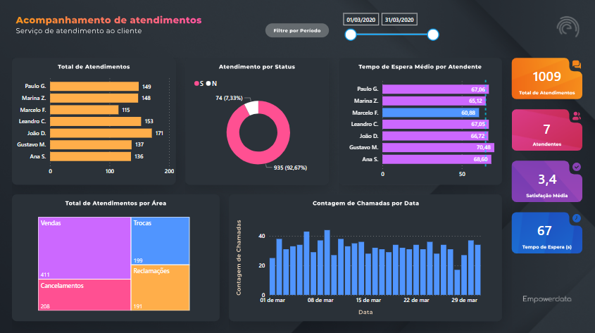

**[Projeto 23 - Power BI](https://app.powerbi.com/view?r=eyJrIjoiYjUyYzFjMjYtY2U3ZC00NGUxLThiYmQtYzkwMGI3ZGFhNzYxIiwidCI6IjdlYmVmODBjLTEwMjctNDEyOS1iNDg0LWNjZjJiZDNmZDU4ZiJ9) | Atualizado: 11/03/2024**

[Índice ↑](#indice)

---

### Acompanhamento de Atendimento Hospitalares 

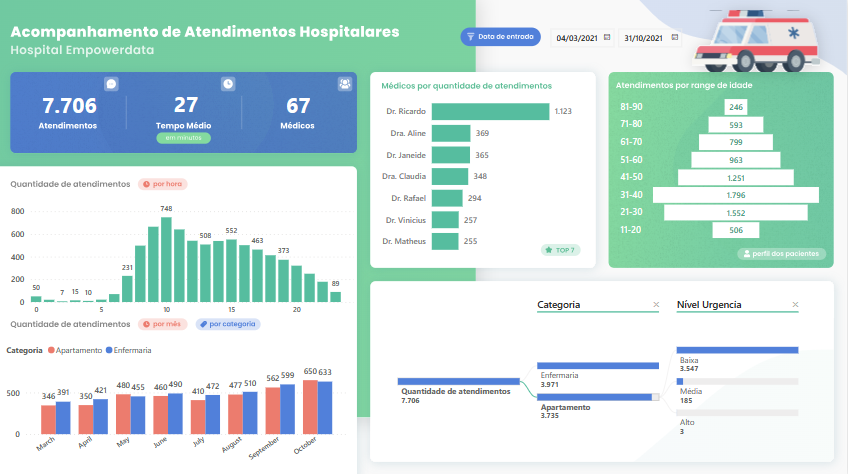

**[Projeto 24 - Power BI](https://app.powerbi.com/view?r=eyJrIjoiOTVhMjRmMDQtYTY1YS00ZTk3LTg1MmMtY2FiMzZkZWQ5MTFjIiwidCI6IjdlYmVmODBjLTEwMjctNDEyOS1iNDg0LWNjZjJiZDNmZDU4ZiJ9) | Atualizado: 11/03/2024**

[Índice ↑](#indice)

---

### Relatório - Pesquisa de Satisfação dos Colaboradores 

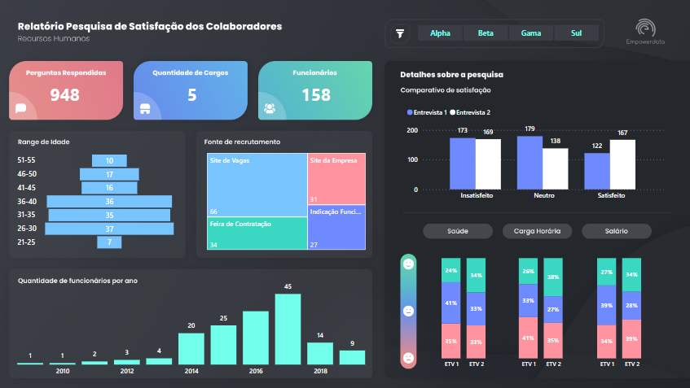

**[Projeto 25 - Power BI](https://app.powerbi.com/view?r=eyJrIjoiZmZlN2RlN2QtZmJmZC00YjFlLTgxNjMtZDM5ZGQ1OTgwNTViIiwidCI6IjdlYmVmODBjLTEwMjctNDEyOS1iNDg0LWNjZjJiZDNmZDU4ZiJ9) | Atualizado: 11/03/2024**

[Índice ↑](#indice)

---

### People Analytics: Mapeamento de Colaboradores 

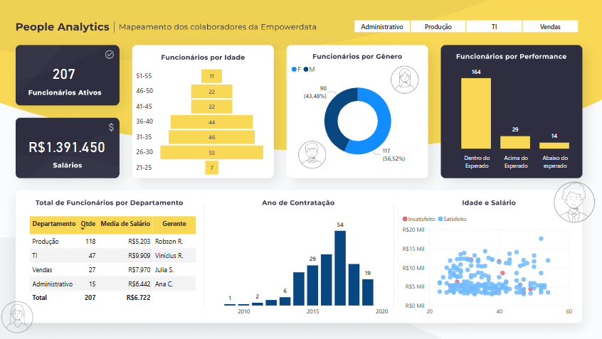

**[Projeto 26 - Power BI](https://app.powerbi.com/view?r=eyJrIjoiNDg0Y2Y4NTAtMjFjNC00MDZjLTk3YzYtMTA4NTY5Yzg1NzY2IiwidCI6IjdlYmVmODBjLTEwMjctNDEyOS1iNDg0LWNjZjJiZDNmZDU4ZiJ9) | Atualizado: 11/03/2024**

[Índice ↑](#indice)
